# 📊 System Diagrams - Edu Insight Meet

## Mục lục
- [1. Kiến trúc Hệ thống](#1-kiến-trúc-hệ-thống)
- [2. Luồng Người Dùng](#2-luồng-người-dùng)
- [3. Sơ đồ Component](#3-sơ-đồ-component)
- [4. Sequence Diagrams](#4-sequence-diagrams)
- [5. Luồng AI Detection](#5-luồng-ai-detection)
- [6. Data Flow](#6-data-flow)
- [7. Deployment Architecture](#7-deployment-architecture)

---

## 1. Kiến trúc Hệ thống

### 1.1 High-Level Architecture


### 1.2 Technology Stack


---

## 2. Luồng Người Dùng

### 2.1 User Journey - Teacher


### 2.2 User Journey - Student

```mermaid
flowchart TD
    Start([Student Opens App]) --> Login{Logged In?}
    Login -->|No| Auth[Login/Register Page]
    Auth --> SelectRole[Select Role: Student]
    SelectRole --> Dashboard[Dashboard]
    Login -->|Yes| Dashboard
    
    Dashboard --> InputCode[Enter Room Code: ABC123]
    InputCode --> PreJoin[Pre-join Settings]
    
    PreJoin --> CheckCam{Camera OK?}
    CheckCam -->|Yes| CheckMic{Mic OK?}
    CheckCam -->|No| FixCam[Fix Camera]
    FixCam --> CheckCam
    
    CheckMic -->|Yes| Join[Join Room]
    CheckMic -->|No| FixMic[Fix Microphone]
    FixMic --> CheckMic
    
    Join --> InRoom[In Meeting Room]
    
    InRoom --> Learning{Activities}
    Learning -->|Watch| WatchTeacher[Watch Teacher Present]
    Learning -->|Self Check| ViewHistory[View Own Behavior]
    Learning -->|Interact| RaiseHand[Raise Hand/Speak]
    Learning -->|Control| Toggle[Toggle Cam/Mic]
    
    ViewHistory --> SelfBehavior[See AI Detection]
    SelfBehavior --> Focused[🎯 Focused: 85%]
    SelfBehavior --> Distracted[😕 Distracted: 10%]
    SelfBehavior --> Sleeping[😴 Sleeping: 5%]
    
    Focused --> Improve[Self-Improve]
    Distracted --> Improve
    Sleeping --> Improve
    Improve --> InRoom
    
    WatchTeacher --> InRoom
    RaiseHand --> InRoom
    Toggle --> InRoom
    
    Learning -->|End| Leave[Leave Meeting]
    Leave --> End([End])
    
    style Dashboard fill:#3b82f6
    style InRoom fill:#10b981
    style ViewHistory fill:#8b5cf6
    style Improve fill:#10b981
```



---

## 3. Sơ đồ Component

### 3.1 Frontend Component Architecture

```mermaid
graph TB
    subgraph "Pages"
        Home[page.tsx]
        Auth[auth/page.tsx]
        Dash[dashboard/page.tsx]
        PreJoin[meet/code/page.tsx]
        Room[meet/code/room/page.tsx]
        History[history/page.tsx]
        Settings[settings/page.tsx]
    end
    
    subgraph "Layouts"
        RootLayout[layout.tsx]
        DashLayout[DashboardLayout]
        Sidebar[Sidebar]
    end
    
    subgraph "Components"
        AIDetector[AIBehaviorDetector]
        BehaviorHistory[BehaviorHistoryPanel]
        StudentPanel[StudentsBehaviorPanel]
        VideoGrid[VideoGrid]
        ControlBar[ControlBar]
    end
    
    subgraph "Contexts"
        AuthCtx[AuthContext]
        MeetingCtx[MeetingContext]
    end
    
    subgraph "Libraries"
        AILib[ai-detector.ts]
        LiveKitLib[@livekit/components-react]
    end
    
    subgraph "API Routes"
        TokenAPI[api/meet/token/route.ts]
    end
    
    RootLayout --> Home
    RootLayout --> Auth
    
    DashLayout --> Dash
    DashLayout --> History
    DashLayout --> Settings
    DashLayout --> Sidebar
    
    PreJoin --> Room
    
    Room --> AIDetector
    Room --> BehaviorHistory
    Room --> StudentPanel
    Room --> VideoGrid
    Room --> ControlBar
    
    AIDetector --> AILib
    VideoGrid --> LiveKitLib
    ControlBar --> LiveKitLib
    
    Auth --> AuthCtx
    PreJoin --> MeetingCtx
    Room --> MeetingCtx
    Room --> AuthCtx
    
    Room --> TokenAPI
    
    style Room fill:#3b82f6
    style AIDetector fill:#10b981
    style VideoGrid fill:#f59e0b
```

### 3.2 AI Detection Component Flow


---

## 4. Sequence Diagrams

### 4.1 Create & Join Meeting Sequence


### 4.2 AI Behavior Detection Sequence

```mermaid
sequenceDiagram
    participant V as Video Element
    participant AID as AIBehaviorDetector
    participant AI as AI Detector Library
    participant TF as TensorFlow.js
    participant UI as UI Components
    participant TP as Teacher Panel
    
    Note over V,TP: AI Detection Lifecycle
    
    AID->>AI: initialize()
    AI->>TF: Load FaceMesh Model
    TF-->>AI: Model Ready
    AI-->>AID: Initialized ✓
    
    loop Every 500ms
        AID->>V: Get Current Frame
        V-->>AID: Video Frame
        
        AID->>AI: detect(videoFrame)
        AI->>TF: Process Frame
        TF->>AI: Return Face Landmarks
        
        AI->>AI: Analyze Head Pose
        AI->>AI: Detect Face Direction
        AI->>AI: Calculate Engagement
        
        alt Student Focused
            AI-->>AID: {label: "Tập trung", emoji: "🎯"}
        else Student Distracted
            AI-->>AID: {label: "Mất tập trung", emoji: "😕"}
        else Student Sleeping
            AI-->>AID: {label: "Buồn ngủ", emoji: "😴"}
        end
        
        AID->>UI: Update Badge
        UI-->>AID: Rendered
        
        alt Is Student
            AID->>UI: Update Own History
        else Is Teacher Monitoring
            AID->>TP: Send to Teacher Dashboard
            TP->>TP: Update Statistics
            TP-->>AID: Acknowledged
        end
    end
```



### 4.3 Screen Share Sequence


### 4.4 Teacher Monitoring Individual Student

```mermaid
sequenceDiagram
    actor T as Teacher
    participant TP as Teacher Panel
    participant State as Behavior State
    participant Timeline as Timeline View
    participant AI as AI Detectors
    
    Note over T,Timeline: Teacher Monitors Class
    
    loop Continuous Updates
        AI->>State: addStudentBehavior(studentData)
        State->>State: Store in Array
        State->>TP: Trigger Update
        TP->>TP: Refresh Dashboard
    end
    
    TP->>T: Display Stats
    Note right of TP: 👥 25 Students<br/>✅ 18 Focused (72%)<br/>⚠️ 5 Distracted (20%)<br/>😴 2 Sleeping (8%)
    
    T->>TP: Click on "Nguyễn Văn A"
    TP->>State: getStudentHistory("student-A-id")
    State-->>TP: Return 20 recent behaviors
    
    TP->>Timeline: Render Timeline
    Timeline-->>T: Show Details
    Note right of Timeline: 10:05 - 🎯 Tập trung<br/>10:08 - ✋ Giơ tay<br/>10:15 - 😔 Cúi đầu<br/>10:20 - 🎯 Tập trung
    
    TP->>TP: Calculate Student Stats
    Note right of TP: Focused: 75%<br/>Distracted: 15%<br/>Sleeping: 10%
    
    T->>T: Make Decision
    alt Student Needs Help
        T->>UI: Ask student if OK
    else Student Doing Fine
        T->>TP: Continue monitoring
    end
```



---

## 5. Luồng AI Detection

### 5.1 AI Detection Pipeline


### 5.2 Behavior Classification Logic

```mermaid
flowchart TD
    Start[Video Frame Input] --> Detect{Face Detected?}
    
    Detect -->|No| NoFace[Return: Chưa phát hiện 👤]
    Detect -->|Yes| GetPose[Get Head Pose]
    
    GetPose --> CheckYaw{Check Yaw<br/>Face Direction}
    
    CheckYaw -->|Straight -10° to +10°| CheckPitch{Check Pitch<br/>Up/Down}
    CheckYaw -->|Left/Right > 30°| LookAway[Mất tập trung 😕]
    
    CheckPitch -->|Neutral -15° to +15°| CheckEyes{Check Eyes}
    CheckPitch -->|Down < -30°| HeadDown[Cúi đầu 😔]
    CheckPitch -->|Up > 30°| LookingUp[Nghiêng đầu 🤔]
    CheckPitch -->|Down -15° to -30°| PossibleSleep{Eyes State?}
    
    PossibleSleep -->|Closed| Sleeping[Buồn ngủ 😴]
    PossibleSleep -->|Open| Thinking[Đang suy nghĩ 🤔]
    
    CheckEyes -->|Looking Center| Focused[Tập trung 🎯]
    CheckEyes -->|Looking Away| Distracted[Mất tập trung 😕]
    
    GetPose --> CheckGesture{Detect Gesture?}
    CheckGesture -->|Hand Raised| RaiseHand[Giơ tay ✋]
    CheckGesture -->|Nodding| Nodding[Gật đầu 👍]
    CheckGesture -->|Shaking| Shaking[Lắc đầu 👎]
    CheckGesture -->|None| CheckYaw
    
    NoFace --> End[Return Result]
    LookAway --> End
    HeadDown --> End
    LookingUp --> End
    Sleeping --> End
    Thinking --> End
    Focused --> End
    Distracted --> End
    RaiseHand --> End
    Nodding --> End
    Shaking --> End
    
    style Focused fill:#10b981
    style Distracted fill:#f59e0b
    style Sleeping fill:#ef4444
    style RaiseHand fill:#3b82f6
```



---

## 6. Data Flow

### 6.1 Real-time Data Flow


### 6.2 Token Generation Flow

```mermaid
flowchart LR
    subgraph Client
        UI[User Interface]
        Store[Session Storage]
    end
    
    subgraph API
        Route[/api/meet/token]
        Validate[Validate Request]
        Generate[Generate JWT]
    end
    
    subgraph Environment
        Key[LIVEKIT_API_KEY]
        Secret[LIVEKIT_API_SECRET]
        URL[LIVEKIT_URL]
    end
    
    subgraph LiveKit
        Verify[Verify Token]
        Grant[Grant Access]
        Room[Room Access]
    end
    
    UI -->|POST {roomName, userName}| Route
    Route --> Validate
    
    Validate -->|Read| Key
    Validate -->|Read| Secret
    
    Validate --> Generate
    Generate -->|Use| Key
    Generate -->|Sign with| Secret
    
    Generate -->|Return JWT| UI
    UI -->|Save| Store
    
    UI -->|Connect with JWT| Verify
    Verify -->|Check| Secret
    Verify -->|Valid| Grant
    Grant --> Room
    
    style Generate fill:#10b981
    style Verify fill:#f59e0b
    style Room fill:#3b82f6
```

---

## 7. Deployment Architecture

### 7.1 Production Deployment

```mermaid
graph TB
    subgraph "Users"
        Teacher[👨‍🏫 Teachers]
        Student[👨‍🎓 Students]
    end
    
    subgraph "CDN - Vercel Edge Network"
        Edge1[Edge Node - Asia]
        Edge2[Edge Node - US]
        Edge3[Edge Node - EU]
    end
    
    subgraph "Vercel Platform"
        Next[Next.js Application]
        API[API Routes]
        SSR[Server-Side Rendering]
        Static[Static Assets]
    end
    
    subgraph "LiveKit Cloud"
        SFU1[SFU Server - Singapore]
        SFU2[SFU Server - Tokyo]
        SFU3[SFU Server - US-West]
        Turn[TURN Servers]
    end
    
    subgraph "Client Processing"
        TF[TensorFlow.js]
        Video[WebRTC]
        AI[AI Detection]
    end
    
    subgraph "Storage"
        LS[Browser LocalStorage]
        SS[Session Storage]
    end
    
    Teacher --> Edge1
    Student --> Edge1
    Teacher --> Edge2
    Student --> Edge3
    
    Edge1 --> Next
    Edge2 --> Next
    Edge3 --> Next
    
    Next --> API
    Next --> SSR
    Next --> Static
    
    API --> SFU1
    SSR --> SFU2
    API --> SFU3
    
    SFU1 --> Turn
    SFU2 --> Turn
    SFU3 --> Turn
    
    Turn --> Video
    Video --> TF
    TF --> AI
    
    AI --> LS
    API --> SS
    
    style Next fill:#3b82f6
    style SFU1 fill:#f59e0b
    style AI fill:#10b981
```



### 7.2 Network Flow & Performance


### 7.3 Scaling Strategy


---

## 8. Security Architecture

### 8.1 Authentication & Authorization Flow


### 8.2 Data Privacy & Security

```mermaid
flowchart TB
    subgraph "Data Categories"
        PII[Personal Info<br/>Email, Name]
        Video[Video/Audio<br/>Streams]
        AI[AI Detection<br/>Data]
        Session[Session<br/>Data]
    end
    
    subgraph "Storage"
        Local[LocalStorage<br/>Client-side]
        Memory[In-Memory<br/>Temporary]
        None[Not Stored]
    end
    
    subgraph "Encryption"
        HTTPS[HTTPS<br/>TLS 1.3]
        SRTP[SRTP<br/>Media Encryption]
        JWT[JWT<br/>Signed Tokens]
    end
    
    subgraph "Security Measures"
        Expire[Token Expiration]
        Validate[Input Validation]
        CORS[CORS Policy]
        CSP[Content Security Policy]
    end
    
    PII -->|Encrypted| Local
    Video -->|End-to-end| SRTP
    AI -->|Temporary| Memory
    Session -->|Signed| JWT
    
    Local --> HTTPS
    SRTP --> None
    Memory --> Expire
    JWT --> Validate
    
    HTTPS --> CORS
    Validate --> CSP
    
    style Video fill:#ef4444
    style AI fill:#10b981
    style HTTPS fill:#3b82f6
    
    note1[⚠️ Video never stored on server<br/>AI processed locally only<br/>No recording feature]
    note2[🔒 All API calls over HTTPS<br/>WebRTC encrypted with SRTP<br/>Tokens expire after session]
```



---

## 9. Performance Metrics

### 9.1 System Performance Targets


---

## 📚 Tài liệu tham khảo

- **Next.js:** https://nextjs.org/docs
- **LiveKit:** https://docs.livekit.io
- **TensorFlow.js:** https://www.tensorflow.org/js
- **MediaPipe:** https://google.github.io/mediapipe/
- **WebRTC:** https://webrtc.org/

---

**© 2026 Edu Insight Meet - System Architecture Documentation**
